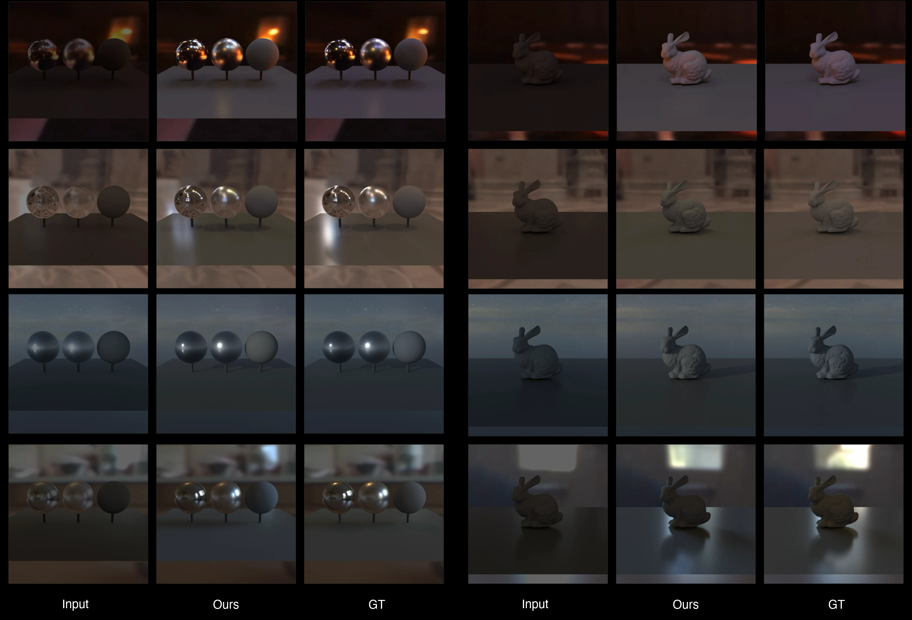

# Promoting LDR Panoramas to HDRI with Rendering-Space Losses (SIGGRAPH 2026 Posters)

[](https://eyeline-labs.github.io/HDRI/)
[](https://dl.acm.org/doi/10.1145/3799825.3818762)
[](https://github.com/Eyeline-Labs/DiffHDR)
[](https://huggingface.co/ZhengmingYu/DiffHDR)

[Zhengming Yu](https://yzmblog.github.io/)<sup>1,3</sup>, [Li Ma](https://limacv.github.io/homepage/)<sup>1</sup>, [Mingming He](https://mingminghe.com/)<sup>1</sup>, [Jingdong Zhang](https://evergreen0929.github.io/)<sup>3</sup>, [Jionghao Wang](https://shanemankiw.github.io/)<sup>3</sup>, [Ning Yu](https://ningyu1991.github.io/)<sup>1,2</sup>, [Paul Debevec](https://www.pauldebevec.com/)<sup>1,2</sup><br/>
<sup>1</sup>Eyeline Labs, <sup>2</sup>Netflix, <sup>3</sup>Texas A&amp;M University<br/>

<p align="center">
  
</p>

## 📝 Abstract

> Captured HDR panoramas are often clipped at sensor saturation, destroying the highlight radiance that drives both diffuse irradiance and specular IBL shading. Existing reconstruction methods optimize pixel metrics that do not reflect rendering quality. We fine-tune Wan 2.1 VACE 14B via LoRA with two novel rendering-space losses: a diffuse SH loss and a glossy GGX convolution loss, both computed in linear radiance from the predicted clean latent. We report IBL-focused metrics on 50 PolyHaven panoramas test set and qualitative relighting comparisons.

## 💻 Code

We integrate our code into [DiffHDR](https://github.com/Eyeline-Labs/DiffHDR).

## 📚 Citation

```bibtex
@inproceedings{yu2026promoting,
  title={Promoting LDR Panoramas to HDRI with Rendering-Space Losses},
  author={Yu, Zhengming and Ma, Li and He, Mingming and Zhang, Jingdong and Wang, Jionghao and Yu, Ning and Debevec, Paul},
  booktitle={Proceedings of the Special Interest Group on Computer Graphics and Interactive Techniques Conference Posters},
  pages={1--3},
  year={2026}
}
```
